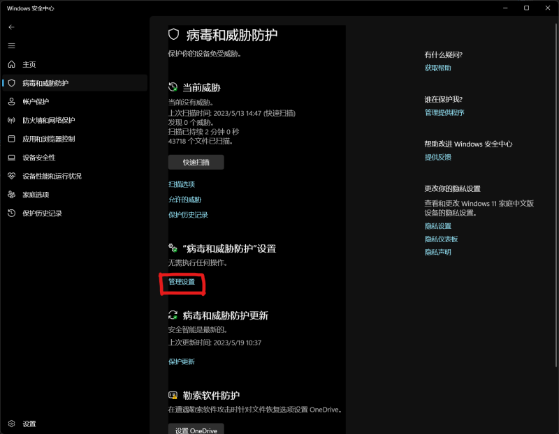
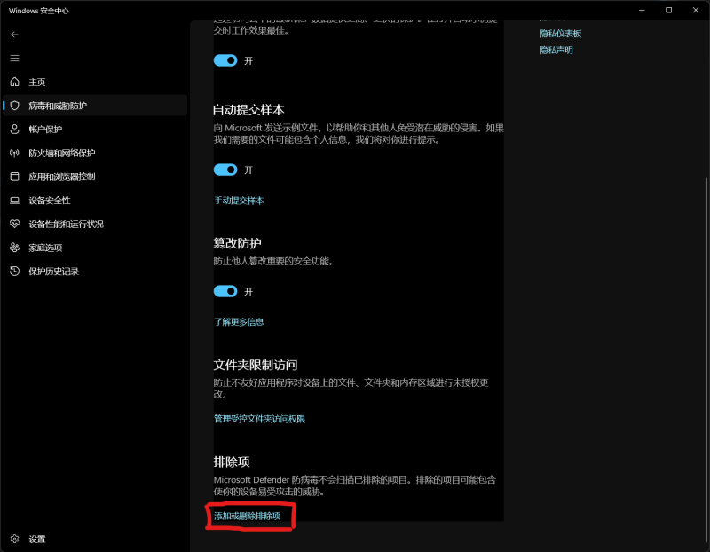
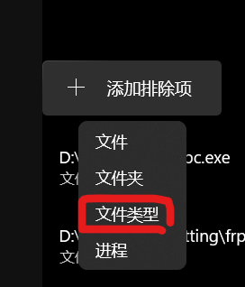

# 未找到frpc

## 检查目录
- 你的软件是否与frpc同一目录
- frpc.exe不要更改名字  
```
你的目录
.
├─frpc.exe                // 你需要把frpc.exe放在这里
└─EFS_client_xxx.exe      // 软件本体
```
## 我还没有frpc
前往frpc的github下载最新的发行版本：
[Frp下载](https://github.com/fatedier/frp/releases/latest)   
根据`检查目录`步骤来解压frp
## 每次启动软件时frpc.exe都消失了
这大概率是杀毒软件导致的问题,请将你的软件所在的目录添加至白名单  
### 以windows安全中心为例
- 使用这个方法强烈建议你的目录是一个独立的目录,这一整个目录都会使安全中心失效  
- 进入安全中心`病毒防护威胁设置`

- 移动到页面最下方找到`排除项`

- 添加排除项选择`文件夹类型`,再选择到你的软件目录

- 将上面的步骤完成后再重新将`frpc.exe`放回
